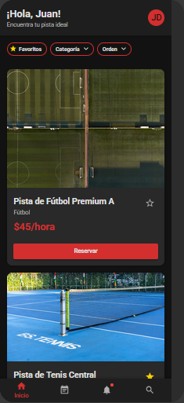
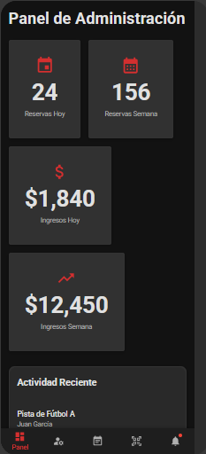

# Gestión Integral de Reservas

Este proyecto es una aplicación móvil nativa para Android desarrollada en **Kotlin**. Su propósito es automatizar la gestión de reservas de pistas, la administración de usuarios y el registro de pagos, garantizando la integridad de los datos y la prevención de conflictos de horarios.

---

## Stack Tecnológico

* **Lenguaje:** Kotlin.
* **UI:** Jetpack Compose (Material Design 3).
* **Arquitectura:** MVVM con Clean Architecture.
* **Backend:** Firebase (Real-time DB & Auth).
* **Pagos:** Stripe Sandbox.
* **Notificaciones:** Firebase Cloud Messaging.

---

## Arquitectura (MVVM)

* **Model:** Gestión de datos y lógica de negocio con Firebase y persistencia local.
* **View:** Interfaz de usuario reactiva en Jetpack Compose.
* **ViewModel:** Puente entre datos y UI, permitiendo pruebas unitarias aisladas.

---

## Funcionalidades

### Módulo de Usuario
* **Autonomía:** Visualización de disponibilidad en tiempo real.
* **Pagos:** Transacciones seguras y simuladas mediante Stripe.
* **Notificaciones:** Confirmaciones y recordatorios vía Push.

### Módulo de Administración Móvil
* **Gestión "a pie de campo":** Diseñado para administradores que operan fuera de una oficina.
* **Control de Pistas:** Bloqueo por mantenimiento y validación de entradas.

---

## Diseño UI/UX

Para el desarrollo de la interfaz se han seguido los lineamientos de **Material Design 3**, priorizando la legibilidad en entornos exteriores y la eficiencia en la navegación.

| Interfaz de Usuario (Cliente) | Módulo de Administración (Puerta) |
| :---: | :---: |
|  |  |
| *Dashboard principal el usuario* | *Dashboard principal para el administrador* |

> [!TIP]
> Puedes consultar el prototipo interactivo completo y el flujo de navegación en el siguiente enlace:
> [Acceder al proyecto en Figma](https://shove-hue-92607961.figma.site)

---

## Planificación (50 Horas)

| Semana | Actividad Principal | Hito Técnico |
| :--- | :--- | :--- |
| 1 | Análisis y Diseño UI | Mockups Figma |
| 2 | Setup MVVM y Auth | Login/Registro |
| 3 | CRUD y Persistencia | DB Híbrida |
| 4 | Lógica de Conflictos | Algoritmo de validación |
| 5 | Stripe y Push | Flujo de pago completo |
| 6 | Testing y Cierre | APK estable y Memoria |
